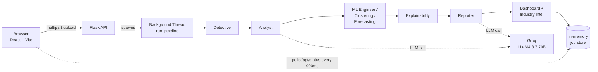
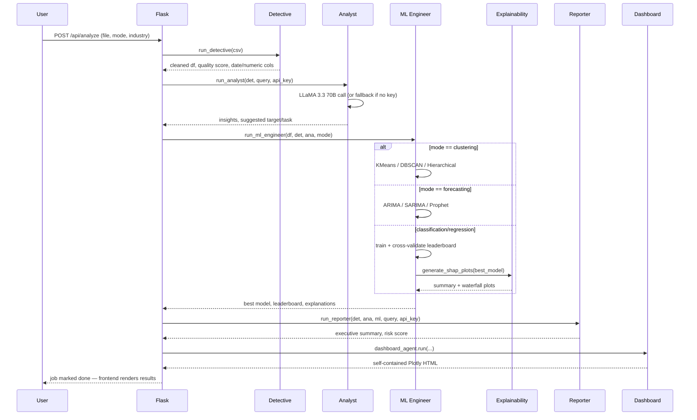

# DataMind Architecture

This doc exists for one reason: when someone asks *"walk me through your architecture"* or *"why did you build it this way"*, the answer should be a clear story, not a guess made up on the spot. Everything below reflects decisions actually made while building this, including the ones that turned out wrong.

## 1. System Overview

The frontend never talks to the agents directly — it uploads a file, gets a `job_id` back immediately, and polls `/api/status/<job_id>` until the background thread finishes. This matters because model training + an LLM call can take anywhere from 1 to 15 seconds; a synchronous request would either time out or force the browser to hang with no feedback. The job-polling pattern is the same shape as any real async ML pipeline (Celery+Redis, SQS+Lambda, etc.) — just implemented with the simplest tool that could possibly work for a single-instance deployment: a thread and a dict.

**Where this breaks down:** the in-memory `jobs` dict means state is lost on restart and doesn't work across multiple server instances. That's a known, accepted limitation for a single-dyno portfolio deployment — see §4.

## 2. Agent Pipeline (sequence)

Every agent is a pure function: `(dict, dict, ...) -> dict`. No agent imports Flask, holds global state, or talks to another agent directly — `app.py`'s `run_pipeline` is the only thing that sequences them. That choice was deliberate, not incidental:

- **Testability.** All 36 tests in `tests/` call agent functions directly with synthetic DataFrames — no Flask app, no mocked HTTP, no test database. A function that takes a DataFrame and returns a dict is trivial to assert against.
- **Independent failure.** If SHAP isn't installed, or Groq is unreachable, or Prophet was never `pip install`ed, that agent degrades to a fallback and the pipeline keeps moving — it doesn't take the whole request down. Every optional dependency (`xgboost`, `lightgbm`, `catboost`, `shap`, `statsmodels`, `prophet`) is wrapped in a `try/except ImportError` exactly so a missing package shrinks the leaderboard instead of crashing the request.
- **Replaceability.** Swapping Groq for another LLM provider, or scikit-learn for a different modeling library, touches exactly one file.

## 3. Why these specific technical choices

**Why Groq (LLaMA 3.3 70B) instead of OpenAI/Anthropic for the insight-generation steps?**
Cost and latency, for a project where the LLM is doing structured summarization (turn this JSON profile into plain English), not open-ended reasoning. Groq's inference is fast enough that the Analyst + Reporter calls together add roughly 1-2 seconds to the pipeline rather than 5-10. For a tool where someone uploads a file and watches a live progress bar, that's the difference between feeling instant and feeling slow. It's a defensible choice, not a "they're free" choice — and the architecture doesn't lock it in: it's one provider behind a `run_analyst(det, query, api_key)` function signature.

**Why agent-based instead of one big `analyze()` function?**
Two reasons that actually mattered during development, not just "it sounds more sophisticated":
1. When clustering/forecasting needed to be added, they slotted in as two new files (`clustering.py`, `forecasting.py`) plus a `mode_override` branch — nothing else in `detective.py` or `analyst.py` had to change.
2. Debugging is localized. When the dashboard was silently broken (see below), the fix was "write one missing file," not "trace through a 1000-line function."

**Why scikit-learn/XGBoost/LightGBM/CatBoost instead of one framework like AutoGluon or PyCaret?**
Those AutoML libraries are excellent but they're black boxes from a learning and a portfolio-narrative standpoint — you can't explain a design decision you didn't make. Hand-rolling the leaderboard (same cross-validation protocol, same scaling/encoding pipeline, across five-to-eight different model classes) meant every choice — why Ridge over plain Linear Regression, why scale before KNN but not before tree models — is something the author can actually defend in an interview.

**Why SHAP specifically for explainability, and why generate static PNGs instead of an interactive plot?**
SHAP has the strongest theoretical grounding (Shapley values from cooperative game theory) of the common feature-attribution methods, and it works model-agnostically across every estimator in the leaderboard — one explainability code path instead of one per model family. Static base64 PNGs (not an interactive JS chart) were a deliberate trade-off: they embed identically in the live HTML dashboard *and* the PDF report with zero extra code, at the cost of not being zoomable. For a one-off explanation per analysis, that trade was worth it.

**Why ARIMA/SARIMA (statsmodels) as the default forecaster, with Prophet optional?**
Prophet needs a C++ build toolchain (`pystan`/`cmdstanpy`) at install time, which is exactly the kind of thing that silently fails on a free-tier host's build step. ARIMA/SARIMA cover the same core need (trend + seasonality) with a pure-Python dependency that installs reliably everywhere. Prophet is still wired in and used automatically if it's present — it's commented out in `requirements.txt`, not removed from the code.

## 4. Known trade-offs (and what changes at real scale)

Being upfront about these is more credible than pretending they don't exist:

| Decision | Fine for a portfolio demo | What changes at scale |
|---|---|---|
| In-memory `jobs` dict + background `threading.Thread` | Yes — one Render/Railway instance, low concurrent users | Redis-backed job queue (Celery/RQ) so jobs survive a restart and multiple workers can pull from one queue |
| ~~`users.json` flat-file auth~~ — migrated to SQLAlchemy (SQLite default) | N/A — already addressed | Set `DATABASE_URL` to Postgres for multi-instance hosting; SQLite-on-one-instance is fine until then |
| Synchronous model training in the request thread | Yes — datasets are small, training takes seconds | Dedicated worker pool, so a slow training job can't starve the web process |
| SHAP recomputed per analysis | Yes — one-off explanations | Cache per (dataset, model) pair if the same data gets re-analyzed often |

None of these are bugs — they're the right call for what this project actually needs to do today, with a clear, articulable path to what changes if the requirements changed. That distinction is the whole point of this document.
